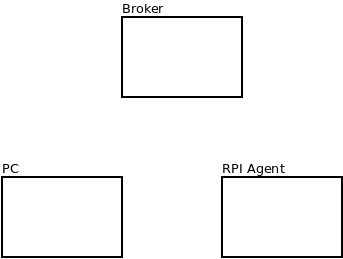

#PLANTUINO III GENERAL STRUCTURE

##DIRECTORY TREE
<pre>
PlantuinoIII
   |
   |-----RPI-Agent   ==> Raspberry PI Plantuino III agent (1)
   |    |
   |    |--- rpi-service
   |	|
   |	|--- python_source
   |
   |--JavaController  ==> JAVA controller to be run in a PC (2)
   |
   |--doc ==> Contains documentation (figures)

</pre>

##(1) RPI AGENT
Controls the behaviour of the RPI Plantuino III agent:
    - GPIOs to control the LEDs

The service is run automatically once deployed in the raspberry
hhhh

The RPI Agent is implemented in Python

##(2) Controller
Controls the behaviour of the different agents.  
The controller is written in Java.  
A Java agent is also built for testing purposes. It is not maintained  
The __GUI__ framework is built using __swing__  

# Exchange of messages between Controller and Agent
Communication is done via an MQTT broker
There are two communication topics:

* __Config topic__. Used to push configuration data from the controller to agents
* __Data topic__. Use to send data from agents to controllers

__Agents__ subscribe to the Config topic at startup.
__Controllers__ subscribe to the Data topic at startup