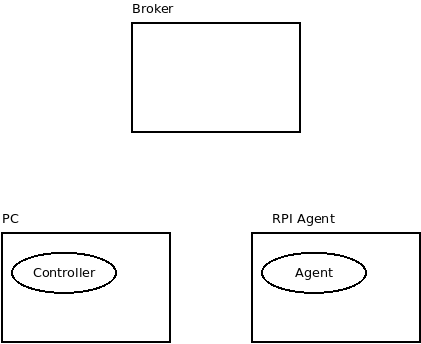

#PLANTUINO III GENERAL STRUCTURE

##DIRECTORY TREE
<pre>
PlantuinoIII
   |  
   |--RPI-Agent   ==> Raspberry PI Plantuino III agent (1)  
     |  
	 |--- rpi-service  
	 |
	 |--- python_source  
</pre>

##(1) RPI AGENT
Controls the behaviour of the RPI Plantuino III agent:
    - GPIOs to control the LEDs

The service is run automatically once deployed in the raspberry
hhhh

